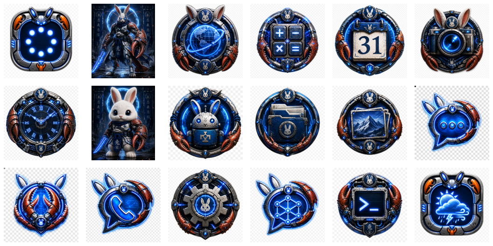
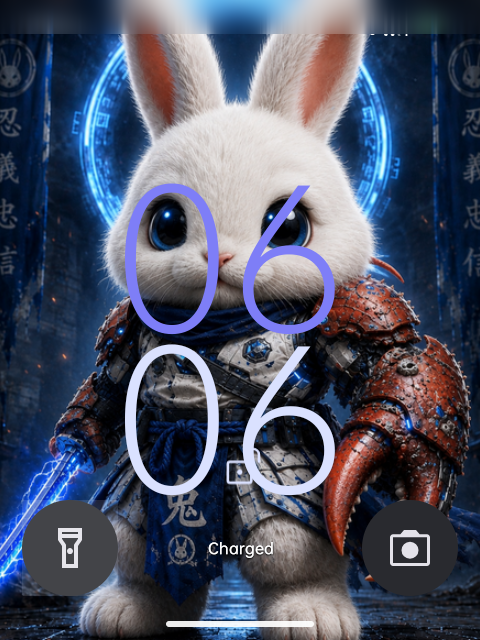
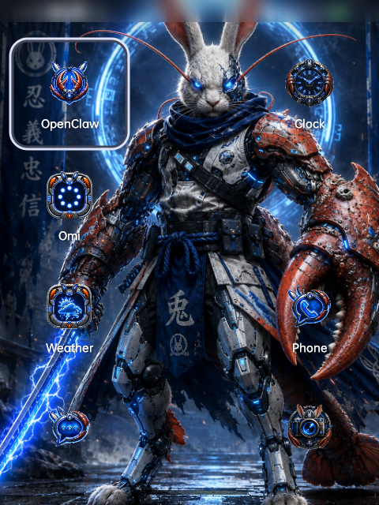
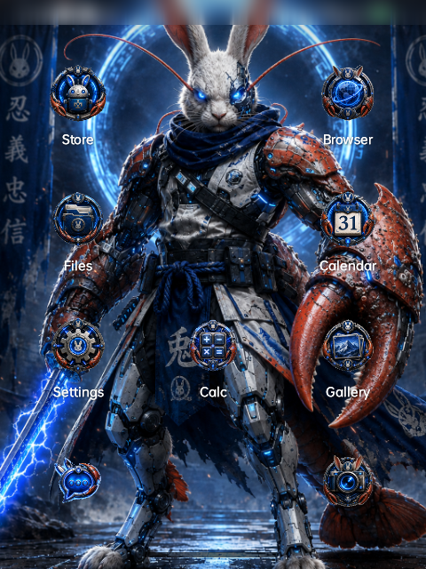

# Splat-I Rabbit R1 OS

RaBobster OS build notes, Rabbit R1 integration files, visual assets, and verified screenshots for the Splat-I Rabbit R1 baseline.

This repository is meant to be usable by a broad audience, including students, first-time Android tinkerers, automation builders, and experienced developers. You do not need to already be an Android ROM expert to understand what is here. The short version is this:

- We took the Rabbit R1 hardware.
- We installed CipherOS on the Rabbit R1 and documented the expected install and first-boot behavior.
- We preserved the current RaBobster visual handoff, including Keyguard, workspace screenshots, and supplied icon artwork.
- We removed the failed custom launcher from the active device and repo path.
- We documented enough breadcrumbs that a person, or their own AI assistant, can rebuild the same baseline from public sources and repo-local assets.

If you are new to this kind of work, start with [docs/RABOBSTER_REBUILD_GUIDE.md](docs/RABOBSTER_REBUILD_GUIDE.md). It explains the project in plain language and includes a copy/paste prompt you can give to your own AI coding assistant.

## Current Baseline

- Primary branch: `main`
- Stable checkpoint: current `main`
- Target device: Rabbit R1
- Verified live-device baseline: CipherOS 7.0 ALHENA / Android 16 on `cipher_r1`
- Primary OS path: install the official CipherOS Rabbit R1 build, then apply the RaBobster handoff assets
- Secondary build harness path: LineageOS 21 / Android 14 GSI path, retained as historical integration context
- Home/workspace package: `com.android.launcher3/.CipherLauncher`
- Removed launcher package: `io.splati.rabobster.launcher`
- Side button behavior: single tap wakes, double tap locks into Keyguard, long hold remains available for PTT behavior

## Repository Contents

- `device_rabbit_r1/` - Rabbit R1 device-tree overlay, keylayout, init scripts, system properties, boot animation, KeyHandler, and StepMotorControls integration.
- `harness/` - setup, slim, and verify helper scripts for source-build experiments.
- `docs/assets/brand/` - repo-local RaBobster image assets used by the current lockscreen/visual handoff.
- `docs/assets/icons/` - supplied RaBobster app icon artwork for Cipher home/workspace customization.
- `docs/assets/screenshots/` - sanitized RaBobster screenshots and contact sheets from the verified device state.

Large generated flash artifacts under `artifacts/` are intentionally ignored. They can be regenerated from the build tree.

Legacy CarrotOS harness screenshots were removed from the current tree so the repo visual evidence reflects the RaBobster build, not the pre-pivot recovery baseline.

## Visual Evidence

The current RaBobster screenshot set is tracked under `docs/assets/screenshots/`:

- `rabobster-keyguard-after-wake.png` - side-button wake path returning to Keyguard.
- `rabobster-workspace-page1.png` and `rabobster-workspace-page2.png` - current Cipher home/workspace pages after the failed launcher was removed.
- `rabobster-contact-sheet.png` - fresh sanitized contact sheet.

The lockscreen source image used for handoff is tracked as `docs/assets/brand/cute-rabobster-lockscreen-480x640.png`.

The supplied icon pack is tracked under `docs/assets/icons/`:



## Acknowledgments

The cute bunny image was created by James Bubenik, based on Rodney's original warrior RaBobster image and concept.

- James Bubenik: <https://github.com/jamesbubenik>

### Current RaBobster Screens





More screenshots and contact sheets are documented in [docs/assets/screenshots/README.md](docs/assets/screenshots/README.md).

## Reproduction Summary

These steps reproduce the repo's OS integration path. The fresh screenshots were captured from the current live Rabbit R1 on CipherOS Android 16 after the failed `io.splati.rabobster.launcher` package was removed.

1. Get CipherOS for Rabbit R1 from the official CipherOS R1 release location: <https://sourceforge.net/projects/cipheros/files/CipherOS-7/r1/>.
2. Use the Rabbit R1 web flasher to place the device into bootloader/fastboot mode.
3. Unlock the bootloader if needed. This can wipe user data.
4. Install or flash CipherOS using the CipherOS/R1 flashing instructions for the build you downloaded or produced.
5. Expect the unlocked-bootloader warning on startup. It is safe to let the device continue; the warning does not mean the OS failed to boot.
6. Let CipherOS complete first boot, then confirm the home handler is `com.android.launcher3/.CipherLauncher`.
7. Apply the RaBobster visual assets from `docs/assets/brand/` and `docs/assets/icons/`.
8. Compare the device against `docs/assets/screenshots/`.

The current repo no longer includes or installs the discarded custom launcher APK.

## Public Release Notes

This repository is documentation, integration scaffolding, and visual evidence. It does not provide a ready-made RaBobster APK or a complete public ROM download. Use the official CipherOS Rabbit R1 release as the OS base.

Do not publish private signing keys, account tokens, device identity files, NV partitions, private recovery dumps, or generated flash images in forks or issue reports.

## Useful Checks

```bash
git status --short --branch
rg -n --hidden --glob '!.git/**' --glob '!*.png' --glob '!*.jpg' --glob '!*.zip' --glob '!*.apk' --glob '!*.img' -i '(api[_-]?key|secret|token|password|authorization:|bearer |-----BEGIN (RSA|OPENSSH|PRIVATE)|ghp_|github_pat_|sk-)' .
```
