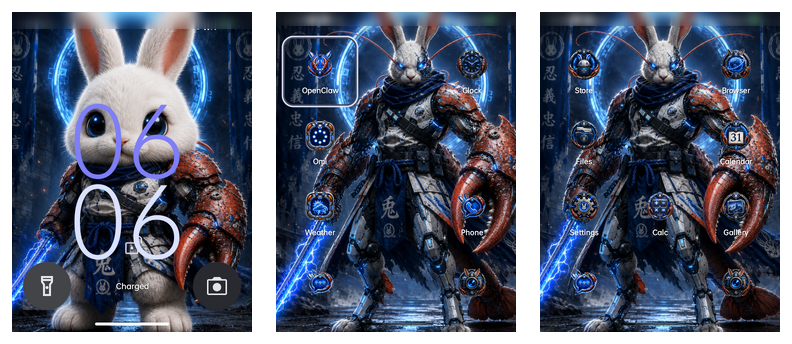

# RaBobster Screenshot Evidence

This directory contains sanitized, repo-local visual evidence for the current RaBobster Rabbit R1 OS state.

The current set was freshly captured on 2026-06-20 from a Rabbit R1 running CipherOS 7.0 ALHENA / Android 16 after the failed `io.splati.rabobster.launcher` package was removed. Carrier and Wi-Fi identifiers were redacted before commit.

These images are not decorative. They are proof points for rebuilders. If your rebuilt device does not resemble these screens after following the handoff guide, treat that as a signal to stop and compare your build, launcher, overlay, and flash steps before continuing.

James Bubenik created the cute bunny image based on Rodney's original warrior RaBobster image and concept: <https://github.com/jamesbubenik>.

## Included Files

- `rabobster-keyguard-after-wake.png` - verified single-tap side-button wake to Keyguard.
- `rabobster-workspace-page1.png` - current Cipher home/workspace page 1.
- `rabobster-workspace-page2.png` - current Cipher home/workspace page 2.
- `rabobster-contact-sheet.png` - contact sheet of the fresh sanitized screenshots.

## Source

These files were captured from the current device on 2026-06-20 after Rodney flagged that the older screenshots showed the failed and unnecessary launcher.

The old CarrotOS-era harness screenshots are intentionally not kept in the current tree because they no longer describe the reproducible RaBobster baseline.

## Inline Gallery

### Keyguard

The side button should wake to the Keyguard surface with the RaBobster image.

### Home And Workspace

These two screenshots show the cleaned Cipher home/workspace baseline that a successful reproduction should roughly match.

### Contact Sheets

The contact sheets are useful when comparing a build quickly without opening every single image.

